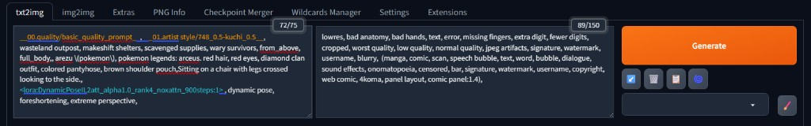
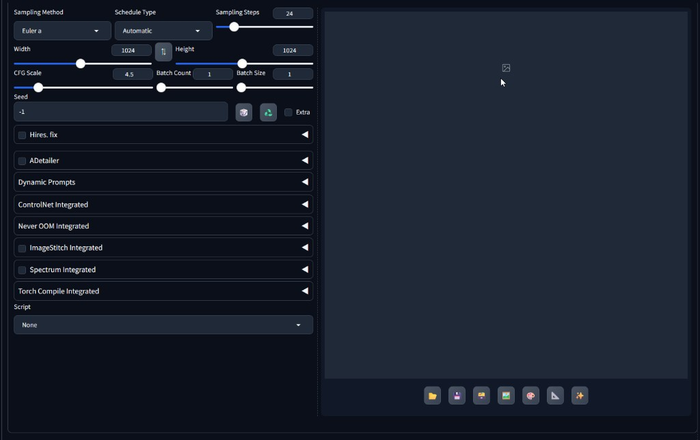

# sd-generation-layout

Designed for **Stable Diffusion WebUI Forge - Neo**.

Reorganizes **txt2img / img2img** generation controls so prompts, dimensions, and sampling parameters are more compact and readable. Includes prompt syntax highlighting and smart insertion to reduce switching between LoRA, Wildcard, and multiple prompt fields.



*Figure 1: Special tokens in the prompt field are color-coded — **Wildcard** (`__name__`) in **orange**, **LoRA** (`<lora:name:weight>`) in **cyan**, with regular descriptive text in the default color. Quickly spot dynamic variables and loaded LoRAs at a glance.*



*Figure 2: Width, dimension tools, and height on **one horizontal row**; CFG Scale, Batch count, and Batch size **merged into one row**; Hires fix and ADetailer **moved out of the accordion stack**, placed directly after Seed — common parameters visible without expanding panels.*

---

## Features

| Item | Description |
|------|-------------|
| Side-by-side prompts | Positive and negative prompts displayed side by side, at 2× default height (`12em`); text overflow shows a vertical scrollbar instead of auto-growing; auto-scrolls to the latest line when typing near the bottom (Gradio-like); manually resizable via drag handle |
| Horizontal dimension row | **txt2img**: width, dimension tools, and height on one row; **img2img**: Resize to / Resize by tabs preserved, same horizontal layout inside Resize to |
| CFG / Batch on one row | CFG Scale, Batch count, Batch size (and Distilled CFG when visible) merged into one row |
| Hires fix repositioned | **txt2img**: Hires fix and ADetailer moved out of the accordion area, placed after the Seed block — no need to expand accordions |
| Prompt syntax highlighting | Wildcard tokens (default `__name__`) shown in **orange**, LoRA tokens in **cyan**; supports Hires prompt fields |
| Focus-aware smart insert | Clicking LoRA or style cards inserts text into the **currently focused** prompt field (including Hires prompts), not always the positive prompt |
| Wildcard card toggle | Single-click a Wildcard card to **add or remove** the corresponding `__token__` in the prompt (requires an extension that provides Wildcard card UI, e.g. [forge-split-extra-networks](https://github.com/BulbulLeung/forge-split-extra-networks)) |
| Non-invasive install | Lives under `extensions/` only; does not overwrite core `modules/` or theme `style.css` |

---

## Installation

### Method 1: Manual install

1. Copy or download this repository into your WebUI `extensions` directory:

   ```
   <your WebUI root>/extensions/sd-generation-layout/
   ```

2. Restart the WebUI, or go to **Settings → Actions → Reload UI**.

3. Under **Settings → Extensions**, confirm `sd-generation-layout` is enabled.

### Method 2: Install from URL

1. Open the **Extensions** tab.
2. Choose **Install from URL**.
3. Paste this repository URL:

   ```
   https://github.com/BulbulLeung/sd-generation-layout.git
   ```

4. Restart the WebUI after installation.

---

## Usage

This extension requires **no extra settings** — layout and highlighting are applied automatically when the UI loads.

### Prompt syntax highlighting

Special tokens are color-coded in these fields:

| Type | Default style | Example |
|------|---------------|---------|
| Wildcard | Orange `#ff9800` | `__character__` |
| LoRA (positive) | Cyan `#26c6da` | `<lora:name:0.8>` |
| LoRA (negative) | Cyan `#26c6da` | `(lora:0.8)` |

If [sd-dynamic-prompts](https://github.com/adieyal/sd-dynamic-prompts) is installed, the Wildcard wrap character is read from the `dp_parser_wildcard_wrap` option in **Settings** (default `__`).

### Focus-aware insertion

1. Click the prompt field you want to edit (positive, negative, or Hires prompt).
2. Click a LoRA or style card in Extra Networks — text is inserted near the cursor in that field, with comma separators handled automatically.
3. If the same Wildcard token is already in the field, clicking the Wildcard card again removes it.

The insert separator follows the WebUI `extra_networks_add_text_separator` setting (default `, `).

### Layout changes summary

**txt2img / img2img (shared):**

- `#txt2img_prompt_row` and `#txt2img_neg_prompt_row` (same for img2img) arranged side by side.
- CFG / Batch controls merged into `.gen-layout-cfg-batch-row`.

**txt2img only:**

- Width, dimension tools, and height merged into `.gen-layout-dimensions-row`.
- `#txt2img_hr` (Hires fix) and ADetailer accordions moved after Seed.

**img2img only:**

- `#img2img_tabs_resize` kept inside the dimension row.
- Width, tools, and height inside the Resize to tab arranged horizontally (`.gen-layout-img2img-resize-to-row`).

---

## File structure

```
sd-generation-layout/
├── metadata.ini
├── style.css
├── README.md
├── preview-prompts.png           # Figure 1: Wildcard / LoRA syntax highlighting
├── preview-settings.png          # Figure 2: Parameter row layout
└── javascript/
    ├── sd_generation_layout.js   # Layout DOM reordering
    ├── prompt_highlight.js       # Prompt syntax highlight overlay
    └── prompt_focus.js           # Focus tracking, card insert, Wildcard toggle
```

---

## Compatibility

| Item | Description |
|------|-------------|
| Target platform | Stable Diffusion WebUI **Forge - Neo** |
| Backend | None (pure JavaScript + CSS, no Python scripts) |
| sd-dynamic-prompts | Optional; provides custom Wildcard wrap character setting |
| forge-split-extra-networks | Optional; provides Wildcard card UI for single-click token toggle |
| ADetailer | Optional; ADetailer accordion position is adjusted alongside Hires fix |

Layout logic runs on `onUiLoaded` and `onAfterUiUpdate` to adapt to Gradio UI updates. If other extensions modify the same DOM nodes, layout conflicts may occur.

---

## License

This project is licensed under **AGPL-3.0**, the same license as [Stable Diffusion WebUI](https://github.com/AUTOMATIC1111/stable-diffusion-webui).
